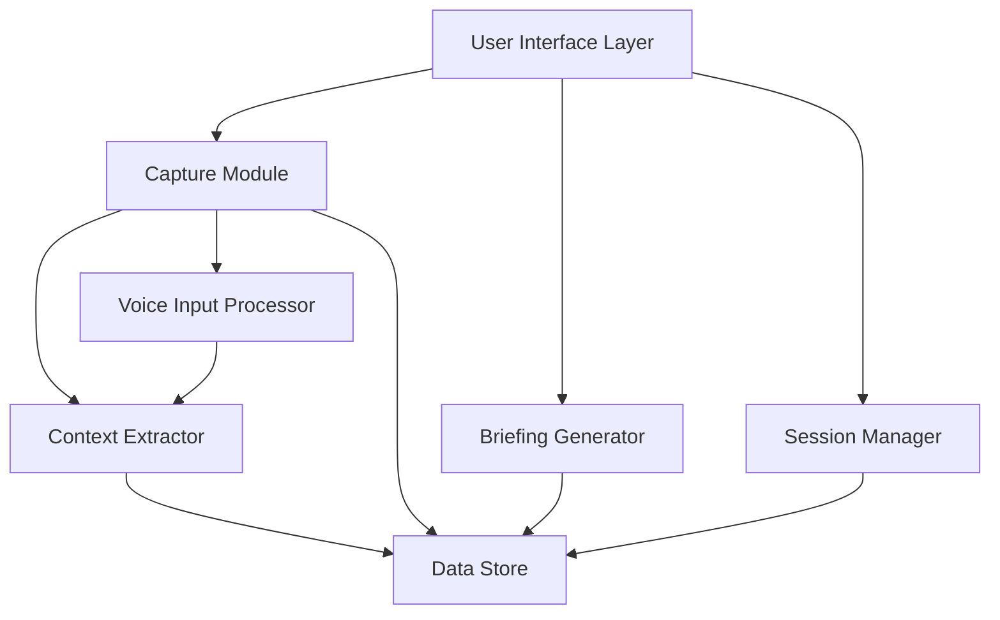

# Design Document: Reentry Assistant

## Overview

The Reentry Assistant is a personal restart assistant that captures working context during exits and provides focused briefings when users return to work. The system addresses the workflow memory problem where users lose their intent and progress state when stepping away from complex work.

The design follows five core principles:

1. **Near-zero capture effort**: Quick captures in under 30 seconds, interrupt captures in under 2 seconds
2. **Restart briefing focus**: Structured briefings showing intent, progress, open loops, and next action
3. **Intent over tasks**: Captures why the user was working, not just what they were doing
4. **Session-based approach**: Each work period is a distinct session with entry/exit boundaries
5. **Graceful degradation**: System provides useful information even when context is incomplete

The system consists of three primary components: the Capture Module (records context during exits), the Briefing Generator (creates restart briefings), and the Session Manager (tracks work periods and timestamps). These components work together to minimize context reconstruction time from 15-20 minutes to under 2 minutes.

## Architecture

### System Components



### Component Responsibilities

**User Interface Layer**
- Provides quick capture interface (voice and text input)
- Displays restart briefing cards
- Handles interrupt capture triggers
- Collects accuracy feedback
- Shows visual feedback during voice recording

**Capture Module**
- Accepts voice and text input
- Coordinates with Voice Input Processor for audio transcription
- Delegates context extraction to Context Extractor
- Enforces timing constraints (30s for quick capture, 2s for interrupt)
- Associates captures with current session
- Records exit timestamps

**Context Extractor**
- Parses capture input (voice transcription or text)
- Identifies intent statements
- Identifies last action statements
- Identifies open loop statements
- Identifies next action statements
- Handles missing elements gracefully
- Preserves original input verbatim

**Voice Input Processor**
- Manages audio recording lifecycle
- Detects silence (2-second threshold)
- Transcribes audio to text using speech-to-text service
- Handles transcription failures with retry prompts

**Briefing Generator**
- Retrieves session data and associated captures
- Calculates time away from timestamps
- Formats briefing cards with available context elements
- Indicates missing elements when captures are incomplete
- Provides retroactive reconstruction guidance
- Ensures briefing generation within 5 seconds

**Session Manager**
- Creates new sessions on project entry
- Closes sessions on project exit
- Maintains separate session histories per project
- Identifies most recent session for a project
- Calculates time away durations
- Stores entry and exit timestamps

**Data Store**
- Persists session data locally
- Persists capture data locally
- Persists feedback data locally
- Maintains data integrity across application restarts
- Provides failure notifications

### Data Flow

**Capture Flow (Planned Exit)**
1. User initiates quick capture via UI
2. UI accepts voice or text input (30-second window)
3. If voice: Voice Input Processor records, detects silence, transcribes
4. Capture Module receives text (transcribed or direct)
5. Context Extractor parses text and identifies elements
6. Session Manager associates capture with current session
7. Data Store persists capture and updates session exit timestamp

**Capture Flow (Interrupt)**
1. User triggers interrupt capture (accessible within 2 seconds)
2. UI accepts single sentence (voice or text)
3. Processing follows same flow as planned exit but optimized for speed
4. System records minimal context to enable quick exit

**Briefing Flow (Re-entry)**
1. User returns to project
2. Session Manager identifies most recent session
3. Briefing Generator retrieves session and capture data
4. Briefing Generator calculates time away
5. Briefing Generator formats briefing card with available elements
6. UI displays briefing within 5 seconds
7. User provides optional accuracy feedback
8. Feedback stored with session data

## Components and Interfaces

### Capture Module Interface

```typescript
interface CaptureModule {
  // Initiate quick capture for planned exits
  startQuickCapture(sessionId: string): CaptureSession;
  
  // Initiate interrupt capture for abrupt exits
  startInterruptCapture(sessionId: string): CaptureSession;
  
  // Submit text input for capture
  submitTextCapture(captureSession: CaptureSession, text: string): Promise<CaptureResult>;
  
  // Submit voice input for capture
  submitVoiceCapture(captureSession: CaptureSession, audioData: AudioBuffer): Promise<CaptureResult>;
}

interface CaptureSession {
  id: string;
  sessionId: string;
  type: 'quick' | 'interrupt';
  startTime: Date;
  timeoutMs: number; // 30000 for quick, 2000 for interrupt
}

interface CaptureResult {
  success: boolean;
  captureId: string;
  extractedContext: ContextElements;
  originalInput: string;
  timestamp: Date;
  error?: string;
}
```

### Context Extractor Interface

```typescript
interface ContextExtractor {
  // Extract context elements from input text
  extract(input: string): ContextElements;
}

interface ContextElements {
  intent?: string[];
  lastAction?: string[];
  openLoops?: string[];
  nextAction?: string[];
  originalInput: string;
}
```

### Voice Input Processor Interface

```typescript
interface VoiceInputProcessor {
  // Start audio recording
  startRecording(): RecordingSession;
  
  // Stop recording manually
  stopRecording(session: RecordingSession): Promise<AudioBuffer>;
  
  // Transcribe audio to text
  transcribe(audio: AudioBuffer): Promise<TranscriptionResult>;
}

interface RecordingSession {
  id: string;
  startTime: Date;
  isActive: boolean;
}

interface TranscriptionResult {
  success: boolean;
  text: string;
  confidence: number;
  error?: string;
}
```

### Briefing Generator Interface

```typescript
interface BriefingGenerator {
  // Generate restart briefing for a session
  generateBriefing(sessionId: string): Promise<RestartBriefing>;
}

interface RestartBriefing {
  sessionId: string;
  intent?: string[];
  lastAction?: string[];
  openLoops?: string[];
  nextAction?: string[];
  timeAway: TimeAwayDisplay;
  missingElements: string[];
  hasCapture: boolean;
  reconstructionGuidance?: string;
  generatedAt: Date;
}

interface TimeAwayDisplay {
  value: number;
  unit: 'minutes' | 'hours' | 'days' | 'unknown';
  formatted: string;
}
```

### Session Manager Interface

```typescript
interface SessionManager {
  // Create new session for a project
  createSession(projectId: string): Session;
  
  // Close current session
  closeSession(sessionId: string, exitTime: Date): void;
  
  // Get most recent session for a project
  getMostRecentSession(projectId: string): Session | null;
  
  // Calculate time away for a session
  calculateTimeAway(sessionId: string): TimeAwayDisplay;
  
  // Get session history for a project
  getSessionHistory(projectId: string): Session[];
}

interface Session {
  id: string;
  projectId: string;
  entryTime: Date;
  exitTime?: Date;
  captureId?: string;
  feedbackRating?: number;
  feedbackTime?: Date;
}
```

### Data Store Interface

```typescript
interface DataStore {
  // Session operations
  saveSession(session: Session): Promise<void>;
  getSession(sessionId: string): Promise<Session | null>;
  getSessionsByProject(projectId: string): Promise<Session[]>;
  
  // Capture operations
  saveCapture(capture: Capture): Promise<void>;
  getCapture(captureId: string): Promise<Capture | null>;
  
  // Feedback operations
  saveFeedback(sessionId: string, rating: number, timestamp: Date): Promise<void>;
  
  // Lifecycle operations
  loadAllData(): Promise<void>;
  notifyFailure(error: Error): void;
}

interface Capture {
  id: string;
  sessionId: string;
  type: 'quick' | 'interrupt';
  originalInput: string;
  contextElements: ContextElements;
  timestamp: Date;
}
```

## Data Models

### Session Model

Represents a continuous period of work on a project.

```typescript
interface Session {
  // Unique identifier for the session
  id: string;
  
  // Project this session belongs to
  projectId: string;
  
  // When the user started this work session
  entryTime: Date;
  
  // When the user exited this work session (undefined if still active)
  exitTime?: Date;
  
  // Reference to associated capture (if any)
  captureId?: string;
  
  // User feedback rating (1-5 scale, or custom)
  feedbackRating?: number;
  
  // When feedback was provided
  feedbackTime?: Date;
}
```

**Invariants:**
- `id` must be unique across all sessions
- `entryTime` must be a valid timestamp
- If `exitTime` exists, it must be >= `entryTime`
- If `feedbackTime` exists, `feedbackRating` must also exist
- `projectId` must reference a valid project

### Capture Model

Represents context captured during a session exit.

```typescript
interface Capture {
  // Unique identifier for the capture
  id: string;
  
  // Session this capture belongs to
  sessionId: string;
  
  // Type of capture (quick or interrupt)
  type: 'quick' | 'interrupt';
  
  // Original user input (transcribed voice or direct text)
  originalInput: string;
  
  // Extracted context elements
  contextElements: ContextElements;
  
  // When the capture was completed
  timestamp: Date;
}
```

**Invariants:**
- `id` must be unique across all captures
- `sessionId` must reference a valid session
- `originalInput` must be preserved verbatim
- `timestamp` must be a valid timestamp
- `type` must be either 'quick' or 'interrupt'

### Context Elements Model

Represents structured context extracted from capture input.

```typescript
interface ContextElements {
  // What the user was trying to accomplish
  intent?: string[];
  
  // The last action the user completed
  lastAction?: string[];
  
  // Unresolved questions, blockers, or pending decisions
  openLoops?: string[];
  
  // The next action the user planned to take
  nextAction?: string[];
  
  // Original input preserved for reference
  originalInput: string;
}
```

**Invariants:**
- At least one of intent, lastAction, openLoops, or nextAction should be present (but not required)
- `originalInput` must always be present and non-empty
- Arrays can contain multiple elements if multiple instances found
- Empty arrays should be represented as undefined

### Restart Briefing Model

Represents the briefing card displayed to users on re-entry.

```typescript
interface RestartBriefing {
  // Session this briefing is for
  sessionId: string;
  
  // Extracted context elements (may be incomplete)
  intent?: string[];
  lastAction?: string[];
  openLoops?: string[];
  nextAction?: string[];
  
  // Time away calculation
  timeAway: TimeAwayDisplay;
  
  // List of element names that are missing
  missingElements: string[];
  
  // Whether a capture exists for this session
  hasCapture: boolean;
  
  // Guidance for retroactive reconstruction (if no capture)
  reconstructionGuidance?: string;
  
  // When this briefing was generated
  generatedAt: Date;
}

interface TimeAwayDisplay {
  // Numeric value
  value: number;
  
  // Unit of measurement
  unit: 'minutes' | 'hours' | 'days' | 'unknown';
  
  // Human-readable formatted string
  formatted: string; // e.g., "2 hours", "3 days", "45 minutes"
}
```

**Invariants:**
- `sessionId` must reference a valid session
- If `hasCapture` is false, `reconstructionGuidance` should be present
- `missingElements` should list all undefined context element fields
- `timeAway.formatted` should match the value and unit
- `generatedAt` must be a valid timestamp

### Storage Schema

The system uses local storage with the following structure:

```typescript
interface StorageSchema {
  // All sessions indexed by ID
  sessions: Map<string, Session>;
  
  // Sessions indexed by project for quick lookup
  sessionsByProject: Map<string, string[]>; // projectId -> sessionId[]
  
  // All captures indexed by ID
  captures: Map<string, Capture>;
  
  // Schema version for migrations
  version: number;
}
```

**Storage Format:**
- Data persisted as JSON to local file system
- File location: `~/.reentry/data.json` (or platform-specific app data directory)
- Atomic writes to prevent corruption
- Backup created before each write

## Technical Approach

### Context Extraction Strategy

The Context Extractor uses a hybrid approach combining pattern matching and AI-based natural language understanding:

**Pattern Matching (Fast Path)**
- Regex patterns for common phrases: "I was trying to...", "Next I need to...", "Blocked on..."
- Keyword detection: "intent", "goal", "next", "blocker", "question"
- Sentence boundary detection to isolate statements
- Fast, deterministic, works offline

**AI-Based Extraction (Comprehensive Path)**
- Use lightweight language model for semantic understanding
- Prompt engineering to identify intent, actions, and loops
- Handles natural, unstructured input
- Falls back to pattern matching if AI unavailable

**Extraction Process:**
1. Normalize input (trim whitespace, fix common transcription errors)
2. Apply pattern matching to identify obvious elements
3. If patterns yield incomplete results, invoke AI extraction
4. Merge results from both approaches
5. Preserve original input verbatim
6. Mark elements as unavailable if not found

**Example Extraction:**

Input: "I was debugging the authentication flow, found the token expiry issue but need to check if refresh tokens are working correctly. Next I should write a test for the refresh flow."

Extracted:
- Intent: ["debugging the authentication flow"]
- Last Action: ["found the token expiry issue"]
- Open Loops: ["need to check if refresh tokens are working correctly"]
- Next Action: ["write a test for the refresh flow"]

### Voice Input Processing Pipeline

**Recording Phase:**
1. User triggers voice capture
2. System requests microphone permission (if not granted)
3. Audio recording starts with visual feedback (waveform or pulsing indicator)
4. System monitors audio levels for silence detection
5. After 2 seconds of silence, recording stops automatically
6. User can manually stop recording before silence threshold

**Transcription Phase:**
1. Audio buffer sent to speech-to-text service
2. Service options (in priority order):
   - Web Speech API (browser-based, free, works offline in some browsers)
   - OpenAI Whisper API (cloud-based, high accuracy)
   - Local Whisper model (offline, requires setup)
3. Transcription returns text with confidence score
4. If confidence < 0.7, prompt user to review/edit transcription
5. If transcription fails, offer retry or switch to text input

**Error Handling:**
- Microphone access denied: Show text input alternative
- Network error (cloud transcription): Fall back to local model or text input
- Low confidence transcription: Show editable text field with transcription
- Audio quality issues: Provide tips for better recording

### Briefing Generation Logic

**Generation Process:**
1. Retrieve session by ID
2. Check if session has associated capture
3. If capture exists:
   - Load capture data
   - Extract context elements
   - Calculate time away
   - Format briefing with all available elements
4. If no capture exists:
   - Calculate time away (if exit timestamp exists)
   - Create partial briefing with missing element indicators
   - Include retroactive reconstruction guidance
5. Ensure generation completes within 5 seconds
6. Return formatted briefing

**Time Away Calculation:**
```typescript
function calculateTimeAway(exitTime: Date, currentTime: Date): TimeAwayDisplay {
  const diffMs = currentTime.getTime() - exitTime.getTime();
  const diffMinutes = Math.floor(diffMs / 60000);
  const diffHours = Math.floor(diffMs / 3600000);
  const diffDays = Math.floor(diffMs / 86400000);
  
  if (diffMinutes < 60) {
    return {
      value: diffMinutes,
      unit: 'minutes',
      formatted: `${diffMinutes} minute${diffMinutes !== 1 ? 's' : ''}`
    };
  } else if (diffHours < 48) {
    return {
      value: diffHours,
      unit: 'hours',
      formatted: `${diffHours} hour${diffHours !== 1 ? 's' : ''}`
    };
  } else {
    return {
      value: diffDays,
      unit: 'days',
      formatted: `${diffDays} day${diffDays !== 1 ? 's' : ''}`
    };
  }
}
```

**Briefing Card Format:**

```
┌─────────────────────────────────────────┐
│ RESTART BRIEFING                        │
│ Away for: 2 hours                       │
├─────────────────────────────────────────┤
│ 🎯 Intent                               │
│ Debugging the authentication flow       │
│                                         │
│ ✓ Last Action                           │
│ Found the token expiry issue            │
│                                         │
│ 🔄 Open Loops                           │
│ • Need to check if refresh tokens work  │
│                                         │
│ ➡️  Next Action                          │
│ Write a test for the refresh flow       │
└─────────────────────────────────────────┘
```

**Partial Briefing (Missing Context):**

```
┌─────────────────────────────────────────┐
│ RESTART BRIEFING                        │
│ Away for: 3 days                        │
├─────────────────────────────────────────┤
│ ⚠️  No capture available                │
│                                         │
│ Missing: Intent, Last Action,           │
│          Open Loops, Next Action        │
│                                         │
│ 💡 Tip: Review recent commits, files,   │
│    or notes to reconstruct context      │
└─────────────────────────────────────────┘
```

### Storage and Persistence Strategy

**Storage Architecture:**
- Local-first: All data stored on user's device
- Single JSON file for simplicity and atomicity
- In-memory cache for fast access during runtime
- Periodic auto-save (every 30 seconds if changes exist)
- Immediate save on critical operations (capture completion, session close)

**Data Integrity:**
1. **Atomic Writes**: Write to temporary file, then rename (atomic operation)
2. **Backup Strategy**: Keep last 3 versions of data file
3. **Validation**: Verify JSON structure on load
4. **Recovery**: If main file corrupted, attempt to load from backups

**File Structure:**
```
~/.reentry/
  ├── data.json           # Current data
  ├── data.backup.1.json  # Previous version
  ├── data.backup.2.json  # 2 versions ago
  └── data.backup.3.json  # 3 versions ago
```

**Save Operation:**
```typescript
async function saveData(data: StorageSchema): Promise<void> {
  const tempFile = '~/.reentry/data.temp.json';
  const mainFile = '~/.reentry/data.json';
  
  try {
    // Write to temp file
    await fs.writeFile(tempFile, JSON.stringify(data, null, 2));
    
    // Rotate backups if main file exists
    if (await fs.exists(mainFile)) {
      await rotateBackups();
    }
    
    // Atomic rename
    await fs.rename(tempFile, mainFile);
  } catch (error) {
    // Notify user of persistence failure
    notifyFailure(error);
    throw error;
  }
}
```

**Load Operation:**
```typescript
async function loadData(): Promise<StorageSchema> {
  const mainFile = '~/.reentry/data.json';
  const backupFiles = [
    '~/.reentry/data.backup.1.json',
    '~/.reentry/data.backup.2.json',
    '~/.reentry/data.backup.3.json'
  ];
  
  // Try main file first
  try {
    const data = await fs.readFile(mainFile);
    return validateAndParse(data);
  } catch (error) {
    // Try backups in order
    for (const backup of backupFiles) {
      try {
        const data = await fs.readFile(backup);
        return validateAndParse(data);
      } catch (backupError) {
        continue;
      }
    }
    
    // All files failed, return empty schema
    return createEmptySchema();
  }
}
```

**Performance Considerations:**
- In-memory cache prevents repeated file reads
- Debounced auto-save prevents excessive writes
- Indexed lookups (sessionsByProject map) for fast queries
- Lazy loading of capture data (only when needed for briefing)

### Timing Constraints Implementation

**Quick Capture (30-second constraint):**
- UI shows countdown timer
- Voice recording auto-stops after 30 seconds
- Text input accepts submission up to 30 seconds
- After timeout, capture is submitted with whatever input exists
- No hard failure - partial input is better than no input

**Interrupt Capture (2-second accessibility):**
- Global keyboard shortcut (e.g., Cmd+Shift+I)
- Always-visible UI element (floating button or menu bar icon)
- Single-click activation
- Optimized for minimal latency
- Pre-loaded UI components to avoid initialization delay

**Briefing Generation (5-second constraint):**
- Data pre-loaded in memory (no file I/O during generation)
- Context extraction cached from capture time
- Simple template-based formatting
- Async generation with loading indicator
- If exceeds 5 seconds, show partial briefing with "Loading..." for pending elements

### Graceful Degradation Strategy

The system maintains usefulness even when components fail or data is missing:

**Missing Capture:**
- Display time away (always available from session timestamps)
- Show "No capture available" message
- Provide retroactive reconstruction guidance
- Maintain consistent briefing format

**Partial Context Extraction:**
- Display whatever elements were successfully extracted
- Clearly indicate which elements are missing
- Show original input for user reference

**Voice Transcription Failure:**
- Immediate fallback to text input
- Preserve audio for potential retry
- Clear error message with actionable next step

**AI Service Unavailable:**
- Fall back to pattern matching extraction
- May yield fewer extracted elements but still functional
- No user-visible error (seamless degradation)

**Storage Failure:**
- In-memory operation continues
- Periodic retry of save operation
- Clear notification to user about persistence risk
- Offer manual export of current session data


## Correctness Properties

*A property is a characteristic or behavior that should hold true across all valid executions of a system-essentially, a formal statement about what the system should do. Properties serve as the bridge between human-readable specifications and machine-verifiable correctness guarantees.*

### Property 1: Capture accepts both input modalities

*For any* capture (quick or interrupt), the system should accept both voice input and text input as valid input methods.

**Validates: Requirements 1.1, 1.2, 2.3, 2.4**

### Property 2: Quick capture completes within time constraint

*For any* quick capture operation, the time from initiation to completion should not exceed 30 seconds.

**Validates: Requirements 1.3**

### Property 3: Context extraction identifies all element types

*For any* capture input containing intent, last action, open loops, or next action statements, the context extractor should identify and extract those elements.

**Validates: Requirements 1.4, 1.5, 1.6, 1.7, 5.1, 5.2, 5.3, 5.4**

### Property 4: Captures are associated with sessions

*For any* completed capture (quick or interrupt), the capture should be associated with the current session ID.

**Validates: Requirements 1.8, 2.5**

### Property 5: Exit timestamps are recorded

*For any* completed capture, the system should record an exit timestamp for the associated session.

**Validates: Requirements 1.9, 2.6**

### Property 6: Interrupt capture is accessible within time constraint

*For any* interrupt capture initiation, the capture interface should become accessible within 2 seconds.

**Validates: Requirements 2.1**

### Property 7: Interrupt capture processes single sentence input

*For any* single sentence input provided to interrupt capture, the system should accept and process it for context extraction.

**Validates: Requirements 2.2, 2.7**

### Property 8: Briefing is generated on session return

*For any* session return event, the briefing generator should create a restart briefing.

**Validates: Requirements 3.1**

### Property 9: Briefing displays captured context elements

*For any* restart briefing where context elements (intent, last action, open loops, next action) were captured, those elements should be displayed in the briefing.

**Validates: Requirements 3.2, 3.3, 3.4, 3.5**

### Property 10: Briefing always displays time away

*For any* restart briefing, the time away should be displayed regardless of whether other context elements are available.

**Validates: Requirements 3.6, 10.4**

### Property 11: Briefing indicates missing context

*For any* session without a capture, the generated briefing should indicate that context is missing.

**Validates: Requirements 3.7**

### Property 12: Briefing generation meets time constraint

*For any* briefing generation operation, the time from re-entry to briefing display should not exceed 5 seconds.

**Validates: Requirements 3.8**

### Property 13: Session creation on project start

*For any* project start event, the system should create a new session with a unique ID and entry timestamp.

**Validates: Requirements 4.1, 4.5**

### Property 14: Session closure on project exit

*For any* project exit event, the system should close the current session and record an exit timestamp.

**Validates: Requirements 4.2, 4.6**

### Property 15: Session isolation by project

*For any* two different projects, the session history for one project should not contain sessions from the other project.

**Validates: Requirements 4.3**

### Property 16: Most recent session identification

*For any* project with multiple sessions, when returning to that project, the system should identify the session with the most recent entry timestamp.

**Validates: Requirements 4.4**

### Property 17: Time away calculation from timestamps

*For any* session with an exit timestamp, the time away should be calculated as the difference between the current time and the exit timestamp.

**Validates: Requirements 4.7, 8.1, 8.2**

### Property 18: Multiple elements of same type are preserved

*For any* capture input containing multiple instances of the same element type (e.g., multiple open loops), all identified instances should be stored.

**Validates: Requirements 5.5**

### Property 19: Missing elements are marked unavailable

*For any* capture input that lacks a specific element type, that element should be marked as unavailable in the extracted context.

**Validates: Requirements 5.6**

### Property 20: Original input preservation

*For any* capture input, the original text (transcribed or direct) should be stored verbatim without modification.

**Validates: Requirements 5.7**

### Property 21: Voice recording activation

*For any* voice input initiation, the audio recording should become active and provide visual feedback.

**Validates: Requirements 6.1, 6.2**

### Property 22: Silence detection and auto-stop

*For any* voice recording with silence exceeding 2 seconds, the recording should automatically stop.

**Validates: Requirements 6.3, 6.4**

### Property 23: Transcription follows recording

*For any* stopped voice recording, the system should attempt to transcribe the audio to text.

**Validates: Requirements 6.5**

### Property 24: Context extraction follows transcription

*For any* successfully completed transcription, the system should process the resulting text for context extraction.

**Validates: Requirements 6.6**

### Property 25: Transcription failure handling

*For any* transcription failure, the system should prompt the user with options to retry or switch to text input.

**Validates: Requirements 6.7**

### Property 26: Feedback mechanism availability

*For any* displayed restart briefing, an accuracy feedback mechanism should be available to the user.

**Validates: Requirements 7.1**

### Property 27: Feedback acceptance and storage

*For any* feedback submission (positive or negative), the system should accept it, associate it with the session, store the rating, and record a timestamp.

**Validates: Requirements 7.2, 7.3, 7.4, 7.5, 7.6**

### Property 28: Time away display formatting by duration

*For any* calculated time away, the display format should use minutes if less than 60 minutes, hours if between 60 minutes and 48 hours, and days if exceeding 48 hours.

**Validates: Requirements 8.3, 8.4, 8.5**

### Property 29: Unknown time away indication

*For any* session without an exit timestamp, the time away should be indicated as unknown.

**Validates: Requirements 8.6**

### Property 30: Data persistence round-trip

*For any* session or capture data that is persisted, after application restart the loaded data should match the original data.

**Validates: Requirements 9.1, 9.2, 9.3, 9.5, 9.7**

### Property 31: Persistence failure notification

*For any* data persistence operation that fails, the system should notify the user of the failure.

**Validates: Requirements 9.6**

### Property 32: Partial briefing generation without capture

*For any* session without a capture, the system should still generate a partial briefing with available information.

**Validates: Requirements 10.1**

### Property 33: Missing elements indication in briefing

*For any* briefing with unavailable context elements, the briefing should explicitly indicate which elements are missing.

**Validates: Requirements 10.2**

### Property 34: Available elements display in partial briefing

*For any* briefing with some available and some unavailable elements, all available elements should be displayed.

**Validates: Requirements 10.3**

### Property 35: Retroactive reconstruction guidance

*For any* briefing generated without a capture, the briefing should provide guidance on retroactive reconstruction.

**Validates: Requirements 10.5**

### Property 36: Consistent briefing format

*For any* briefing (complete or partial), the visual format structure should remain consistent regardless of which elements are present or missing.

**Validates: Requirements 10.6**

## Error Handling

The system implements comprehensive error handling across all components to ensure graceful degradation and user awareness:

### Capture Module Errors

**Voice Input Failures:**
- **Microphone access denied**: Display clear message and offer text input alternative
- **Audio recording error**: Log error, notify user, fall back to text input
- **Transcription service unavailable**: Attempt local transcription, then fall back to text input
- **Low confidence transcription**: Show editable text field with transcription for user review

**Context Extraction Failures:**
- **AI service unavailable**: Fall back to pattern matching extraction
- **No elements extracted**: Store original input, mark all elements as unavailable
- **Partial extraction**: Store successfully extracted elements, mark others as unavailable

**Timeout Handling:**
- **Quick capture timeout (30s)**: Submit capture with whatever input exists
- **Interrupt capture timeout (2s)**: Submit capture with partial input
- **No timeout failure**: System accepts partial input rather than failing completely

### Session Management Errors

**Session State Errors:**
- **No active session on capture**: Create emergency session with current timestamp
- **Multiple active sessions**: Close all but most recent, log warning
- **Session ID collision**: Generate new unique ID, log error

**Timestamp Errors:**
- **Invalid timestamp**: Use current time as fallback, log warning
- **Exit before entry**: Reject operation, log error, maintain previous state
- **Future timestamp**: Reject, use current time, log warning

### Briefing Generation Errors

**Data Retrieval Errors:**
- **Session not found**: Create minimal briefing with error message
- **Capture not found**: Generate partial briefing with missing context indication
- **Corrupted data**: Attempt recovery from backup, notify user

**Calculation Errors:**
- **Invalid time away calculation**: Display "unknown" time away
- **Missing timestamps**: Display "unknown" time away with explanation

**Performance Errors:**
- **Generation exceeds 5s**: Display partial briefing with loading indicators
- **Timeout**: Show cached briefing or minimal briefing with error notice

### Data Persistence Errors

**Write Failures:**
- **Disk full**: Notify user, continue in-memory operation, retry periodically
- **Permission denied**: Notify user, suggest alternative location, continue in-memory
- **Corruption during write**: Restore from backup, retry write operation

**Read Failures:**
- **File not found**: Initialize with empty data structure
- **Corrupted data**: Attempt recovery from backups (up to 3 versions)
- **All backups corrupted**: Initialize empty, notify user of data loss

**Recovery Strategy:**
- Maintain 3 backup versions of data file
- Atomic writes to prevent partial corruption
- Validation on load with automatic backup fallback
- User notification for all unrecoverable errors

### User Notification Strategy

**Error Severity Levels:**
1. **Critical**: Data loss risk, persistence failure - immediate modal notification
2. **Warning**: Degraded functionality, fallback active - non-blocking notification
3. **Info**: Successful recovery, automatic fallback - subtle indicator

**Notification Content:**
- Clear description of what went wrong
- Impact on user's workflow
- Actionable next steps
- Option to view technical details (for debugging)

## Testing Strategy

The Reentry Assistant requires comprehensive testing to ensure reliability, performance, and correctness across all workflows. The testing strategy employs a dual approach combining property-based testing for universal correctness guarantees and unit testing for specific scenarios and edge cases.

### Property-Based Testing

Property-based testing validates that the system's correctness properties hold across a wide range of generated inputs. This approach is particularly valuable for the Reentry Assistant because user input is highly variable and unpredictable.

**Testing Library:**
- **JavaScript/TypeScript**: Use `fast-check` library for property-based testing
- **Python**: Use `hypothesis` library if implementing backend services
- **Configuration**: Minimum 100 iterations per property test to ensure adequate coverage

**Property Test Structure:**

Each property test must:
1. Reference the design document property number and text in a comment
2. Generate random valid inputs using appropriate generators
3. Execute the system operation
4. Assert the property holds for the generated inputs
5. Run for at least 100 iterations

**Example Property Test:**

```typescript
// Feature: reentry-assistant, Property 3: Context extraction identifies all element types
// For any capture input containing intent, last action, open loops, or next action statements,
// the context extractor should identify and extract those elements.

import fc from 'fast-check';

test('context extraction identifies all element types', () => {
  fc.assert(
    fc.property(
      fc.record({
        intent: fc.array(fc.string(), { minLength: 1 }),
        lastAction: fc.array(fc.string(), { minLength: 1 }),
        openLoops: fc.array(fc.string(), { minLength: 1 }),
        nextAction: fc.array(fc.string(), { minLength: 1 })
      }),
      (elements) => {
        // Generate input text containing all elements
        const input = generateInputWithElements(elements);
        
        // Extract context
        const extracted = contextExtractor.extract(input);
        
        // Verify all elements were identified
        expect(extracted.intent).toBeDefined();
        expect(extracted.lastAction).toBeDefined();
        expect(extracted.openLoops).toBeDefined();
        expect(extracted.nextAction).toBeDefined();
      }
    ),
    { numRuns: 100 }
  );
});
```

**Generators for Property Tests:**

Custom generators needed for domain-specific data:

```typescript
// Generate realistic capture input text
const captureInputGenerator = fc.string({ minLength: 10, maxLength: 500 });

// Generate session with valid timestamps
const sessionGenerator = fc.record({
  id: fc.uuid(),
  projectId: fc.uuid(),
  entryTime: fc.date(),
  exitTime: fc.option(fc.date(), { nil: undefined })
}).filter(s => !s.exitTime || s.exitTime >= s.entryTime);

// Generate context elements with various combinations
const contextElementsGenerator = fc.record({
  intent: fc.option(fc.array(fc.string())),
  lastAction: fc.option(fc.array(fc.string())),
  openLoops: fc.option(fc.array(fc.string())),
  nextAction: fc.option(fc.array(fc.string())),
  originalInput: fc.string()
});

// Generate time durations for time away testing
const timeDurationGenerator = fc.integer({ min: 0, max: 10000000 }); // milliseconds
```

**Property Test Coverage:**

All 36 correctness properties must have corresponding property-based tests:
- Properties 1-36: Each implemented as a separate test
- Each test tagged with feature name and property reference
- Each test configured for minimum 100 iterations
- Tests organized by requirement area (capture, briefing, session, etc.)

### Unit Testing

Unit tests complement property-based tests by validating specific examples, edge cases, and integration points. While property tests verify general correctness, unit tests ensure specific scenarios work as expected.

**Unit Test Focus Areas:**

**Specific Examples:**
- Capture with well-formed input containing all elements
- Capture with minimal input (single sentence)
- Briefing generation with complete capture data
- Briefing generation with no capture data
- Time away formatting for specific durations (30 min, 2 hours, 5 days)

**Edge Cases:**
- Empty capture input
- Capture input with only whitespace
- Session with entry time equal to exit time (zero duration)
- Time away calculation at boundary values (59 min, 60 min, 47 hours, 48 hours)
- Capture with extremely long input (stress test)
- Multiple captures for same session
- Session with no project ID

**Error Conditions:**
- Voice transcription failure
- Data persistence failure
- Invalid session ID
- Corrupted capture data
- Missing timestamps
- AI service timeout

**Integration Points:**
- Voice input → transcription → extraction pipeline
- Capture → session association → persistence flow
- Session retrieval → briefing generation → display flow
- Feedback submission → storage → retrieval

**Example Unit Tests:**

```typescript
describe('Context Extraction', () => {
  test('extracts all elements from well-formed input', () => {
    const input = "I was debugging the auth flow. Found the token issue. " +
                  "Need to check refresh tokens. Next I'll write a test.";
    
    const result = contextExtractor.extract(input);
    
    expect(result.intent).toContain('debugging the auth flow');
    expect(result.lastAction).toContain('Found the token issue');
    expect(result.openLoops).toContain('Need to check refresh tokens');
    expect(result.nextAction).toContain("write a test");
  });
  
  test('handles input with missing elements gracefully', () => {
    const input = "Working on the API.";
    
    const result = contextExtractor.extract(input);
    
    expect(result.originalInput).toBe(input);
    // Some elements may be undefined
    expect(result).toBeDefined();
  });
  
  test('preserves original input verbatim', () => {
    const input = "Test input with  extra   spaces!";
    
    const result = contextExtractor.extract(input);
    
    expect(result.originalInput).toBe(input);
  });
});

describe('Time Away Calculation', () => {
  test('displays minutes for duration under 60 minutes', () => {
    const exitTime = new Date('2024-01-01T10:00:00Z');
    const currentTime = new Date('2024-01-01T10:45:00Z');
    
    const result = calculateTimeAway(exitTime, currentTime);
    
    expect(result.unit).toBe('minutes');
    expect(result.value).toBe(45);
    expect(result.formatted).toBe('45 minutes');
  });
  
  test('displays hours for duration between 60 minutes and 48 hours', () => {
    const exitTime = new Date('2024-01-01T10:00:00Z');
    const currentTime = new Date('2024-01-01T14:00:00Z');
    
    const result = calculateTimeAway(exitTime, currentTime);
    
    expect(result.unit).toBe('hours');
    expect(result.value).toBe(4);
    expect(result.formatted).toBe('4 hours');
  });
  
  test('displays days for duration exceeding 48 hours', () => {
    const exitTime = new Date('2024-01-01T10:00:00Z');
    const currentTime = new Date('2024-01-04T10:00:00Z');
    
    const result = calculateTimeAway(exitTime, currentTime);
    
    expect(result.unit).toBe('days');
    expect(result.value).toBe(3);
    expect(result.formatted).toBe('3 days');
  });
  
  test('handles missing exit timestamp', () => {
    const result = calculateTimeAway(undefined, new Date());
    
    expect(result.unit).toBe('unknown');
    expect(result.formatted).toContain('unknown');
  });
});

describe('Briefing Generation', () => {
  test('generates complete briefing with all elements', async () => {
    const session = createTestSession();
    const capture = createTestCapture({
      intent: ['debugging auth'],
      lastAction: ['found token issue'],
      openLoops: ['check refresh tokens'],
      nextAction: ['write test']
    });
    
    const briefing = await briefingGenerator.generateBriefing(session.id);
    
    expect(briefing.intent).toEqual(['debugging auth']);
    expect(briefing.lastAction).toEqual(['found token issue']);
    expect(briefing.openLoops).toEqual(['check refresh tokens']);
    expect(briefing.nextAction).toEqual(['write test']);
    expect(briefing.timeAway).toBeDefined();
    expect(briefing.missingElements).toHaveLength(0);
  });
  
  test('generates partial briefing without capture', async () => {
    const session = createTestSessionWithoutCapture();
    
    const briefing = await briefingGenerator.generateBriefing(session.id);
    
    expect(briefing.hasCapture).toBe(false);
    expect(briefing.missingElements.length).toBeGreaterThan(0);
    expect(briefing.reconstructionGuidance).toBeDefined();
    expect(briefing.timeAway).toBeDefined();
  });
  
  test('completes generation within 5 seconds', async () => {
    const session = createTestSession();
    const startTime = Date.now();
    
    await briefingGenerator.generateBriefing(session.id);
    
    const duration = Date.now() - startTime;
    expect(duration).toBeLessThan(5000);
  });
});
```

### Performance Testing

**Timing Constraints Validation:**
- Quick capture: Measure end-to-end time, ensure < 30 seconds
- Interrupt capture: Measure accessibility time, ensure < 2 seconds
- Briefing generation: Measure generation time, ensure < 5 seconds
- Voice silence detection: Measure detection latency, ensure < 2 seconds

**Load Testing:**
- Test with 1000+ sessions per project
- Test with 100+ captures per session
- Test briefing generation with large session histories
- Test data persistence with large data files (10MB+)

**Memory Testing:**
- Monitor memory usage during extended operation
- Test for memory leaks in voice recording
- Verify cleanup after session closure

### Integration Testing

**End-to-End Workflows:**
1. Complete capture → briefing cycle
2. Voice input → transcription → extraction → storage
3. Session creation → capture → closure → retrieval → briefing
4. Feedback submission → storage → retrieval

**Cross-Component Integration:**
- Capture Module ↔ Context Extractor
- Voice Processor ↔ Capture Module
- Session Manager ↔ Data Store
- Briefing Generator ↔ Data Store

### Test Organization

```
tests/
├── unit/
│   ├── capture.test.ts
│   ├── context-extraction.test.ts
│   ├── voice-processing.test.ts
│   ├── briefing-generation.test.ts
│   ├── session-management.test.ts
│   ├── time-calculation.test.ts
│   └── data-persistence.test.ts
├── property/
│   ├── capture-properties.test.ts
│   ├── extraction-properties.test.ts
│   ├── briefing-properties.test.ts
│   ├── session-properties.test.ts
│   └── persistence-properties.test.ts
├── integration/
│   ├── capture-flow.test.ts
│   ├── briefing-flow.test.ts
│   └── voice-pipeline.test.ts
└── performance/
    ├── timing-constraints.test.ts
    └── load-testing.test.ts
```

### Test Data Management

**Fixtures:**
- Sample capture inputs (various formats and lengths)
- Sample sessions (various states and durations)
- Sample context elements (complete and partial)
- Sample audio files (for voice testing)

**Mocks:**
- Voice transcription service (for offline testing)
- AI extraction service (for deterministic testing)
- File system operations (for persistence testing)
- Time functions (for time-dependent testing)

### Continuous Testing

**Pre-commit Hooks:**
- Run unit tests
- Run fast property tests (10 iterations)

**CI Pipeline:**
- Run all unit tests
- Run full property tests (100 iterations)
- Run integration tests
- Generate coverage report (target: 80%+ coverage)
- Performance regression testing

**Test Metrics:**
- Code coverage: Target 80%+ for critical paths
- Property test iterations: Minimum 100 per property
- Test execution time: Unit tests < 30s, full suite < 5 minutes
- Flakiness: Zero flaky tests tolerated
